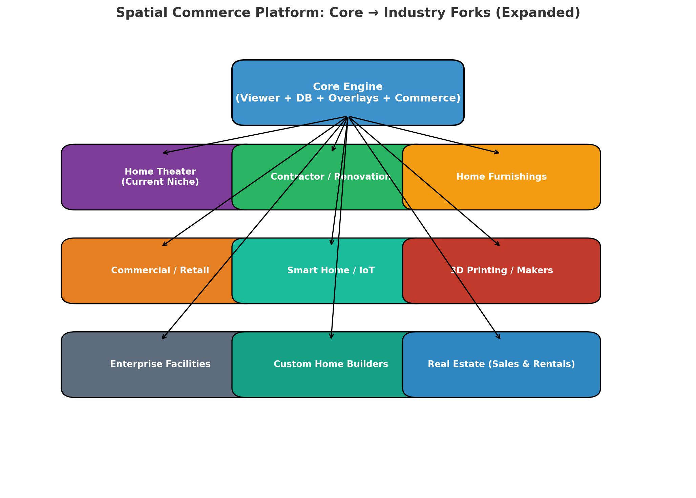

# Spatial Commerce Platform — Expansion Forks

This document tracks potential industries ("forks") where the **Core Engine** 
(Viewer + DB + Overlays + Commerce) can be applied beyond home theater.

---

## Core Engine (Shared Across Verticals)
- Geometry Viewer (GLB/scan import, measure, placement pins)
- Simulation Layer (acoustics → light, flow, energy)
- Equipment/Product DB (SKU-driven, badges for verified/eco/premium)
- Export/Commerce Layer (reports, quotes, carts, affiliate/direct checkout)
- AI Coach (context-aware: calibration, design tips, safety rules)
- Analytics (SKU demand, layout patterns, manufacturer reports)

---

## Industry Forks

| Vertical                  | Revenue Potential (5–7 yrs) | Est. Margin | Notes |
|---------------------------|-----------------------------|-------------|-------|
| Contractor / Renovation   | $150–300M ARR               | 25–35%      | Auto-quotes, BOM, contractor marketplace |
| Home Furnishings          | $75–150M ARR                | 20–30%      | Furniture, decor, lighting; affiliate/direct commerce |
| Commercial / Retail       | $50–100M ARR                | 20–25%      | B2B SaaS for office/retail layouts |
| Smart Home / IoT          | $30–60M ARR                 | ~25%        | Device coverage maps, automation packages |
| 3D Printing / Makers      | $20–40M ARR                 | 30–40%      | STL marketplace, fitment/stress simulation |
| Pro AV / Education        | $15–30M ARR                 | ~20%        | Classrooms, stadiums, AV installers |
| Enterprise Facilities     | $15–25M ARR                 | ~25%        | Energy modeling, safety overlays, slow cycles |
| Home Theater (Current)    | $5–10M ARR                  | ~20%        | Pilot niche proving engine |
| Custom Home Builders      | $50–100M ARR                | ~30%        | Client-facing design viewer; SaaS for builders |
| Real Estate (Sales/Rentals)| $75–150M ARR               | 25–35%      | 3D staging for listings; SaaS for brokerages |

---

## Visual Map

---

## Strategic Layers
- **Short-term:** Contractor + furnishings = fastest monetization.
- **Mid-term:** Custom home builders = stable SaaS with high-value contracts.
- **Long-term:** Real estate = massive TAM, slower adoption but defensible moat.
- **Community/Margin Play:** 3D printing + smart home = loyalty + add-on revenue.

---

_Last updated: 2025-09-01_
